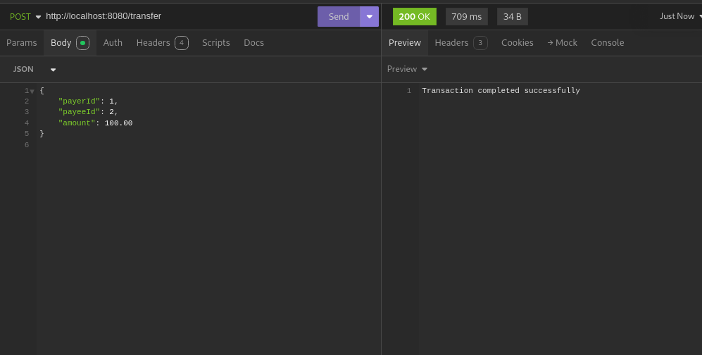
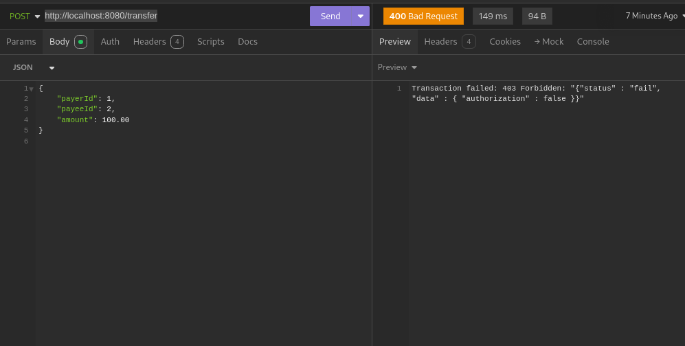
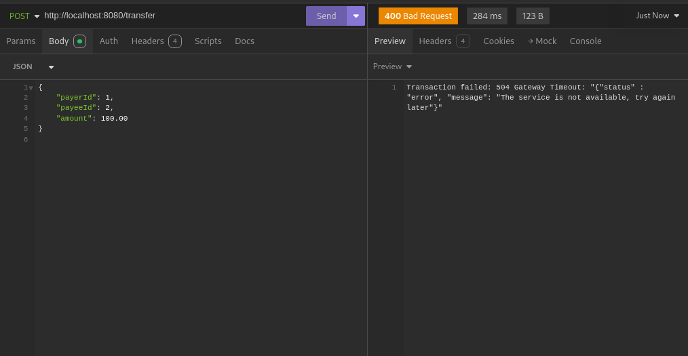
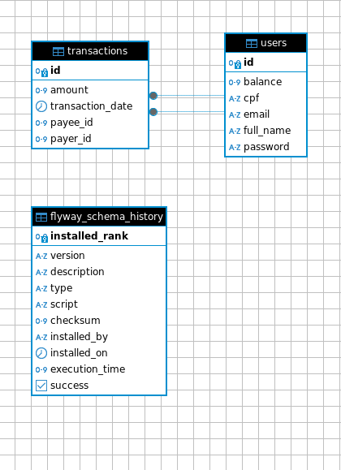

# Desafio PicPay - Iago Silva

Realizei o [Desafio PicPay](https://github.com/PicPay/picpay-desafio-backend) como um exercício de aprendizado, pois sou apaixonado por linguagens de alto nível, como Java, por exemplo. Por isso fui logo fazendo quando vi o repositório.

## 🚀 Funcionalidades Implementadas

Criei uma rota para transferências no endpoint `http://localhost:8080/transfer`, que verifica a disponibilidade do serviço antes de processar a requisição. As rotas utilizadas para simulação são:

- **Autorização**: [https://util.devi.tools/api/v2/authorize](https://util.devi.tools/api/v2/authorize) (verbo `GET`).
- **Notificação**: No recebimento de pagamento, o usuário ou lojista recebe uma notificação (por e-mail ou SMS) enviada por um serviço de terceiros. Esse serviço pode estar indisponível ou instável. Utilize o mock [https://util.devi.tools/api/v1/notify](https://util.devi.tools/api/v1/notify) (verbo `POST`).

### 📜 Regras de Negócio

- A operação de transferência deve ser uma transação atômica. Em caso de inconsistência, a transferência será revertida, e o dinheiro retornará para a carteira do usuário que fez o envio.

### 🏁 Respostas Possíveis

As respostas da API podem ser:

#### ✅ Sucesso

<div style="display: flex; margin: 10px 0; align-items: center; justify-content: center; align-self: center;">
    
</div>

#### ❌ Falha na Autorização

<div style="display: flex; margin: 10px 0; align-items: center; justify-content: center; align-self: center;">
    
</div>

#### ⚠️ Servidor Indisponível

<div style="display: flex; margin: 10px 0; align-items: center; justify-content: center; align-self: center;">
    
</div>

### 🗃️ Estrutura do Banco de Dados

<div style="display: flex; margin: 10px 0; align-items: center; justify-content: center; align-self: center;">
    
</div>

## 📋 Requisitos

Para executar este projeto, você precisará dos seguintes pré-requisitos:

- [Docker](https://www.docker.com/) 🐳
- [Maven](https://maven.apache.org/) 📦
- Java 17 ou superior ☕️

## 💻 Como Começar

Para iniciar o projeto, siga as etapas abaixo:

1. **Executar Docker Compose**: Certifique-se de que todos os serviços necessários estejam em execução. Execute o seguinte comando:

```bash
docker compose up
Isso iniciará os contêineres necessários para a aplicação.
```

2. **Limpar e Instalar Dependências**: Execute o comando a seguir para limpar e instalar todas as dependências do projeto:

```bash
mvn clean install
```

3. **Executar a Aplicação**: Para iniciar a aplicação Spring Boot, utilize o comando:

```bash
./mvnw spring-boot:run
```

4. **Executar Migrações do Flyway**: Para aplicar as migrações do Flyway, utilize o seguinte comando, garantindo que o arquivo de configuração esteja no caminho correto:

```bash
mvn -Dflyway.configFiles=src/main/resources/flyway.conf flyway:migrate
```

5. **Migrar Fresh e Semear**: Para realizar uma migração fresh e semear o banco de dados, execute:

```bash
./mvnw spring-boot:run -Dspring-boot.run.arguments="migrate-fresh-and-seed"
```
